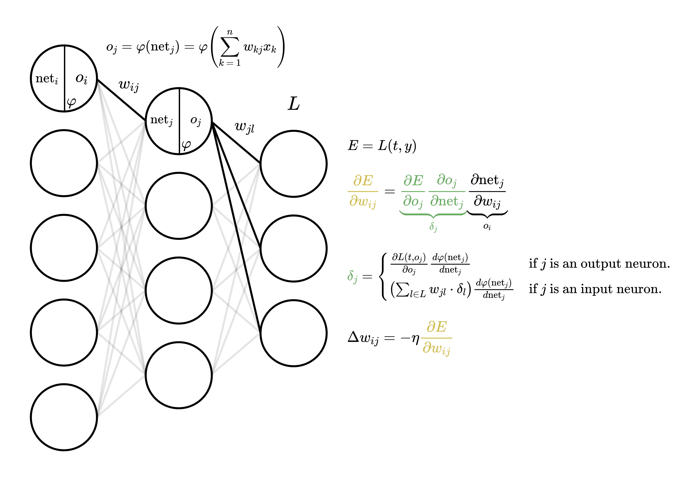

# Neural Network

Complete from-scratch implementation of neural networks (in ≈400-500 lines of code) with examples for training on the
MNIST handwritten digits dataset and CIFAR-10 object recognition dataset. See it in
action [here](https://chjus.github.io/NeuralNetwork/)!

## Implementation and Design

### Structure

A neural network consists of _layers_ of neurons. For example, in the diagram, there are three layers of neurons with 6,
4, and 3 neurons, respectively. Each neuron has weighted connections (whose value may signify the strength and
relationship of their connection) to each neuron in the next layer. Each neuron receives a
weighted input sum (denoted $\text{net}$, the sum of the products of corresponding weights and inputs), and applies an
_activation function_ $\varphi$ to constrain the weighted input within a certain fixed range. A popular choice
of $\varphi$ is the sigmoid activation function:

$$\sigma(x) = \frac{1}{1+e^{-x}},$$

which constrains values to be between 0 and 1 (useful, e.g., when you want the network to output a probability that an
input is from a classification class). You may refer to other activation functions in
the [corresponding section](#activation-functions) below.

The resulting activation becomes the input for the neurons in
the next layer. Notably, we denote each weight $w_{ij}$ connecting the $i\text{th}$ neuron in the current layer to
the $j\text{th}$ neuron in the next layer. As such, the input to the $j\text{th}$ neuron in the middle layer,

$$o_j = \varphi(\text{net}_{j}) = \varphi\left(\sum_{k}{w_{kj}o_{k}}\right).$$

Note that each layer tends to have a _bias_ neuron, whose weight value is simply added to the weighted
sum $\text{net}$ (alternatively, you can consider its input to always be 1).

### Feedforward

In both the learning and classification stage, an example input array/vector is fed as input to the first layer, and
through the weighted sum and activation processes described previously, result in an output vector in the final layer.

### Backpropagation

For a network to learn, its adjustable parameters (the weights) are altered based on the network's classification
errors. Particularly, the goal in the learning process is to minimize error $E=L(t,y)$, where $L$ represents a _loss
function_ that computes error based on the desired target output $t$ and predicted output $y$.

For example, the partial
derivative $$\frac{\partial E}{\partial w_{ij}}= \underbrace{\frac{\partial E}{\partial o_j} \frac{\partial o_j}{
\partial \text{net}_{j}}}_{\delta_j} \underbrace{\frac{\partial \text{net}_{j}}{\partial w_{ij}}}_{o_i}$$ represents the
sensitivity of $E$ with respect to changes to $w_{ij}$. We update the weight $w_{ij}$
as $$w_{ij} = w_{ij} + \Delta w_{ij},$$ with $$\Delta w_{ij} = -\eta \frac{\partial E}{\partial w_{ij}}.$$ Notably, the
negative sign ensures the weight is updated such that the error $E$ as caused by $w_{ij}$ is reduced. The factor $\eta$
is referred to as _step size_ or _learning rate_, and controls the degree to which the weight $w_{ij}$ is adjusted.
Notably, a too large $\eta$ would lead to overcorrection of $w_{ij}$, which may lead to difficulty in minimizing $E$
over all training examples, whereas a too small $\eta$ would result in minimal adjustments, leading to slow learning.

### Optimizers

### Loss functions

### Activation functions

### Note on GD, SGD, and mini-batch GD

### References

- [Backpropagation](https://en.wikipedia.org/wiki/Backpropagation)
- [Activation functions](https://en.wikipedia.org/wiki/Activation_function)
- [Optimizers](https://www.ruder.io/optimizing-gradient-descent/)
- [More on optimizers](https://johnchenresearch.github.io/demon/)
- Based off Y8 me’s overcomplicated (and likely
  inaccurate) [code](https://github.com/JC-ProgJava/Building-Neural-Networks-From-Scratch).